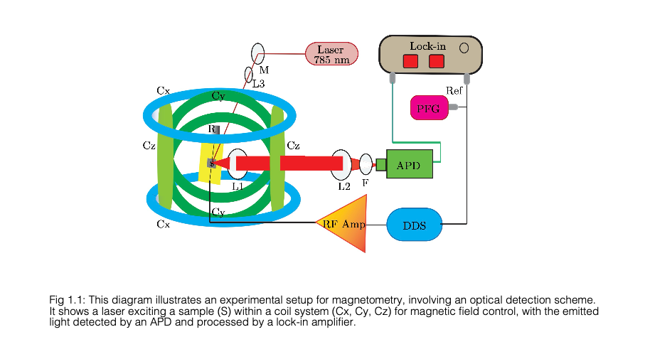

# System Architecture

The ODMR platform consists of five modular subsystems:

1. **Optical Excitation**
   - 808 nm laser diode
   - TEC cooling to –4°C
   - Optical alignment system (L1, L2, mirrors)

2. **RF Excitation**
   - Si5351 Synthesizer (35–225 MHz)
   - ADF4351 Clock Generator (35 MHz – 4.4 GHz)
   - RF amplification

3. **Fluorescence Detection**
   - High-speed photodiode
   - Transimpedance amplifier
   - Optical filters

4. **Signal Processing**
   - Red Pitaya (125 MS/s digitizer)
   - Software lock-in detection
   - Oscilloscope GUI

5. **Control Modules**
   - Python GUIs
   - Arduino interfaces
   - Temperature & humidity control

---

## System Workflow

1. Laser excites SiC defect center  
2. RF synthesizer drives spin transition  
3. Resonance changes fluorescence  
4. Photodiode collects emission  
5. Signal digitized by Red Pitaya  
6. Software or hardware lock-in extracts ODMR dip  
7. GUI plots results in real time  

---

## Block Diagram

```md

